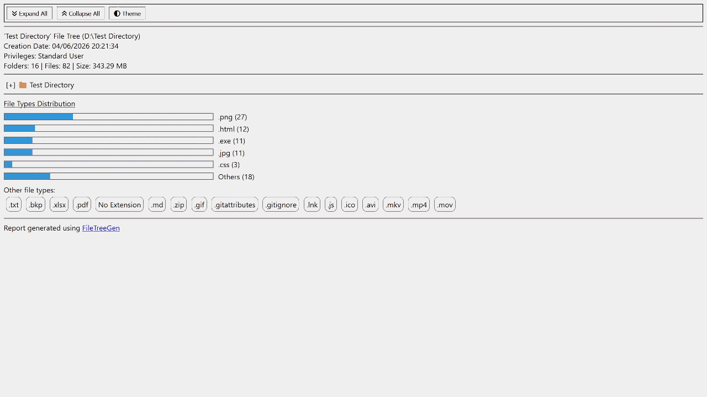
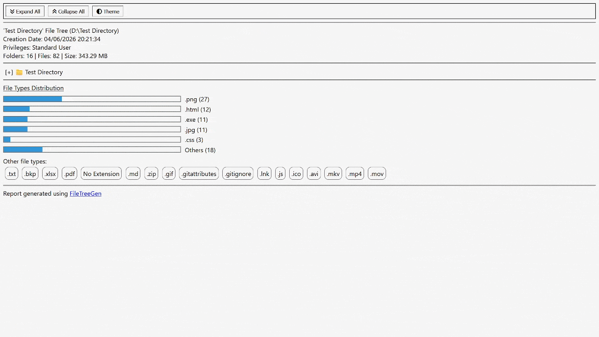

# FileTreeGen
## Short Description
**FileTreeGen** is a simple *Windows CLI-based utility* which generates file trees for given directories. The generated report is a static website with some useful features for better data visualization and organization.

## Main Features
* **🌐 Interactive HTML Output**
	* *Navigation Bar*: located at the top of the report, for quick access to essential features
		* *Expand All* feature: expand all folder nodes instantly, with a click of a button.
		* *Collapse All* feature: there is no need to manually close all nodes, just one click solves this issue.
		* *Theme Changer*: supports both *Light* and *Dark* themes.
	* *Collapsible Directory Nodes*: click on the directory nodes in order to expand/collapse their contents.
	* *Browser File Opening*: clicking on file nodes will open them in your browser if this feature is supported.

* **📂 Structured Data**
	* *File Type Icons*: each file has a small suggestive icon based on its extension.
	* *Suggestive color palette*: each element's color was chosen for better data visualization.

* **📊 File Types Charts**
	* *Bar Charts*: see the top 5 most frequent file types found in the given folder.
	* *Detailed sections:* each extension has its total number of files associated.
	* Every other file type not included in the top 5 is mentioned right under the *Other file types* section.

* **💻 Arguments support**: the app can be used directly from the command-line, with arguments:
	* ```<FileTreeGen> <directory's path> [-filter: <extension 1> ; <extension 2> ...]```
	* Replace *\<FileTreeGen\>* with the app's actual name (which includes the app's version and the OS architecture).
	* *Smart fallback*: if the path is not valid, the app will still open its command-line interface.
	* Add how many extensions you want: the app will only include matching files when generating the report.
	* *Drag-and-drop support*: dragging and dropping the directory on the app's executable will also generate a report.

* **🛡️ Permission-Safe Scanning**
	* All non-accessible directories (due to missing permissions) will be skipped at report generation.
	* The permissions and privileges level is displayed in the top section of the report.

* **👓 Useful Details**
	* Some additional data is included in the report, such as: *the directory's full path*, *creation date & time*, *system privileges* , *number of sub-directories*, *number of files*, *total size*.

* **♿ Accessibility & Keyboard Navigation**
	* Use the `TAB` and `Shift+TAB` keys to navigate between the buttons
	* Use the `Space` and `Enter` keys to open links and expand/collapse nodes
	* *Screen Reader Optimization*: Dynamic ARIA attributes prevent repetitive reading and announce precise context updates.
	* *No Icon Pollution*: Structural emojis & symbols (`📁`, `📂`, `[+]`) are hidden from screen readers, focusing speech solely on the actual node names.

## Technologies used
* Programming Language: *C# (.NET 10)*
* Report Output File: *HTML, CSS, JavaScript*

## Demos
### Features
<p align="center">
  
</p>

### Accessibility
<p align="center">
  
</p>

## Installation
```bash
git clone https://github.com/vlad-stefan-florea/FileTreeGen
cd FileTreeGen
dotnet run
```

## License
This project is licensed under the MIT License - see the *LICENSE.txt* file for details.